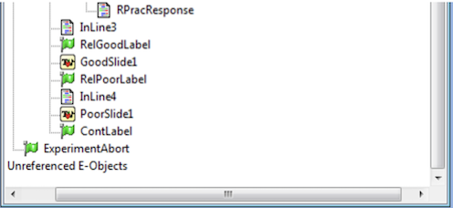

# [Tutorial] How to transform an E-Prime project into a PsychoPy project?

In this document, we are going to show how to reproduce an E-Prime project into a PsychoPy project. We created this document with my colleague to be intended for people who already have a good understanding of E-Prime. If you have any questions, please go to Issues or Discussions.

## General

Below is the general structure of an E-Prime project. The 'Structure' window in E-Prime provides a comprehensive view of our experiment's layout. This window displays the various elements, or 'E-Objects', we have created, organizing them hierarchically. This hierarchy offers an overview of the experiment's flow. For instance, at the top of this hierarchy, we might find a 'List' where the trials are sequentially organized, followed by 'Procedures' and components like 'TextDisplay', 'ImageDisplay', etc., executed in each trial:

Before starting to translate an E-Prime project to PsychoPy, we recommend that you run the E-Prime project at least once to get a feel for the different elements. If this is not possible, you can always analyze the above structure in detail.

## Initializing Parameters

The first E-Object in our structure is the Initialize Parameters. This part is generally used to set initial values for the various variables that will be used throughout the experiment. However, during the translation from E-Prime to PsychoPy, we will omit this section as it is not required in the PsychoPy project.

## Welcome Screen

Below we have the welcome screen which represents the second E-Object. This is the first picture that we will see when starting the experiment:

### Reproducing it in PsychoPy

We are going to start by reproducing this Welcome screen in PsychoPy. Below, we can see the general structure of the project reproduced in PsychoPy. 

A Routine is the basic building block of PsychoPy experiments. We are going to click on the “Insert Routine” button on the bottom left and name it “welcome”.

### Overview of the different components

Then once the routine is created, we can add components to it on the right panel (Code, Text, Joystick, Keyboard, etc.).

The "Code" component allows for the integration of custom Python scripts directly into the experiment, providing a solution for tasks that demand more advanced functionalities beyond the capabilities of PsychoPy's graphical user interface (GUI). We can insert snippets of code that execute at different phases of the trial.

The "Text" component serves the purpose of displaying text on the screen, with customizable attributes like color, size, position, and content. It is commonly utilized for presenting instructions, textual stimuli, or feedback to participants.

The "Joystick" component facilitates the collection of input from a connected joystick, offering a more nuanced response option compared to a keyboard or mouse. This functionality is particularly valuable for experiments involving intricate motor or skill tasks.

The "Keyboard" component is designed to record responses from specified keys, allowing for the configuration of parameters such as the response window duration. It enables the capture of timing information for key presses or releases.

### Code component

We will start editing the code component. This component provides the flexibility to program in Python for running the project locally on our computer or in JavaScript for running the project online on Pavlovia servers.

In our experiment, we use the code component to set the text of another text component named 'text_wel'. The specific text is determined by 'text_wel.text '. Below is an example of Python and JavaScript code to modify this text:

Below is a description of each of the tabs in the code component:

- Before Experiment: Code in this tab runs before the experiment starts, often used for initializing global variables or setting up parameters that will be used throughout the experiment.

- Begin Experiment: Code in this tab runs once at the beginning of the experiment, after "Before Experiment," for tasks like opening files or setting-up elements that need to be ready before the experiment starts.

- Begin Routine: Code here runs at the start of each routine (a routine being a segment of the experiment, like a trial period), often used to initialize/reset routine-specific variables such as participant responses.

- Each Frame: Code here runs on every displayed frame, suitable for controlling rapidly changing visual elements or recording real-time responses.

- End Routine: The code placed here will be executed at the end of each routine. This can be used to record data specific to a routine or to perform calculations based on the participant's actions during that routine.

- End Experiment: Code here runs at the end of the experiment. It may be used for closing files, saving data, or performing any final cleanup or processing needed.

Each tab provides the opportunity to insert code at a specific point in the experiment, giving us very precise control over how our study unfolds.

### Text component

Next, we can take a look at the Text component properties: 

The duration is set to None so the Text will last until the routine ends. There is no text because we set it in the code component.

### Joystick component

Then we can look at the Joystick component properties:

Those properties are pretty self-explanatory. We can see that the option End routine on press is set to valid click and that allowed buttons are set to ‘1’ and ‘2’. So when these buttons are pressed the routine stops.

### Keyboard component

We can look at the Keyboard component properties:

We can see that the case ‘Force End of Routine’ is checked. The Allowed Keys are ‘1’, ‘2’, ‘esc’. The routine will stop and go to the next routine if one of those keys is pressed.

## Separating different practices

In the E-Prime project, we used a table to separate the practice of single blocks from the practice of associative blocks.

This distinction is done differently in PsychoPy, we can simply create different routines there.

## Instructions: Handling Procedures

Then we have a procedure in the structure of the Eprime project. In E-Prime, the procedure object is used to present a sequence of events.

The E-Prime procedure aligns closely with the PsychoPy routine, requiring minimal additional adjustments. Notably, we streamlined instructions (P1, P2, P3, etc.) into a single routine named "instructions," and we defined transitions between instructions using the code component.

The E-Prime procedure includes a "DoAgain" condition for looping and redoing the practice, and PsychoPy provides a similar capability through the use of loops that can be inserted between two routines.

In PsychoPy, a "loop" serves the purpose of repeating a specific part of the experiment multiple times, like redoing the practice. One notable advantage of PsychoPy is its compatibility with CSV files for controlling loop conditions.

Preparing the CSV File: We can prepare a CSV file that contains the different conditions of our experiment. In a PsychoPy conditions file, typically in CSV format, we would find columns containing values that determine the parameters of each trial or iteration in a loop. Common columns might include variables like stimulus names, conditions, response requirements, or any other factors relevant to the design and execution of the experiment.

For example:

ID,image,question,correct_answer

1,Images/Dynamite.bmp,OLD?,1

2,Images/Grill.bmp,LIVING?,1

Here, we have four variables: ID, image, question and correct_answer. 

After creating the CSV, we can click on "Insert Loop" in PsychoPy:

To access the properties of a loop in PsychoPy, simply click on the loop. Within the loop properties, the following key elements are available:

- Name: Identifies the loop within the script.

- LoopType: Defines the loop's type, such as 'Sequential' or 'Random,' determining the trial presentation order.

- Is trials: Indicates if the loop comprises a series of trials.

- nReps: Sets the number of loop repetitions.

- Selected rows: Specifies which rows to use from the conditions file.

- Random Seed: An optional feature to initialize the random number generator for consistent trial order reproduction.

- Conditions: Links to the conditions file (typically an Excel or CSV file) containing trial data.

For the 'practice_block' properties, the path to the CSV file with the experiment conditions is specified. In this instance, the path is stored in a variable named 'pracTxt,' defined in a code component in the experiment, at the beginning of each frame.

Now we can go through each row of the csv and extract some information like 'instr_text_1_en', 'instr_text_2_en', etc. The values associated with these columns are going to define the text component in our routine:

We aim to repeat this practice indefinitely so we set a high number of repetitions: 

Next, we can implement a code component that triggers an exit from the practice when a specific key is pressed:

Pressing the "t" key marks the completion of the practice and ends the current routine. Additionally, the variable 'good_response,' responsible for counting correct answers, is reset to 0. This reset occurs when either redoing the practice or proceeding to the next trial.

## Adding the practice stimulus

Here is how the stimulus look in E-prime:

In the current task, both pictures are presented simultaneously, and participants respond with a 'yes' or 'no' to the stimuli (which is a question).

In the PsychoPy project, we adopt a different approach. The first image is displayed, followed by the stimuli, and then the second image. Participants are allowed to respond only when the second image appears.

Below is the structure of the practice routine in the PsychoPy task:

Similar to the approach taken with the instructions, we will establish the conditions for the practice loop using a variable containing the path of the CSV file intended for the practice.

The CSV file is going to be pretty much exactly the same than the table we have in the E-prime task: 

In the code component of the routine, we set the pictures of the image components using the values specified in the CSV file.

To fetch images from the CSV file, we utilize the column names that represent each image and save them into variables.

We can then add these variables to the image components:

The picture now changes with each trial.

In the ‘Each Frame’ tab of the code components we have the display logic of the routine:

The code monitors various components in a routine, such as items, questions, joystick buttons, and timers. It sets flags or response values based on their status, capturing participant interactions or the component's current state.

Then in the ‘End Routine’ tab we have the logic that occurs after each loop: 

Here we are organizing the information which will appear in the CSV output at the end of the experiment.

This code primarily records various data points related to the participant's response in the experiment. 

This includes the participant's actual response, the correct response, whether or not they were correct, their reaction time for the response, and their cumulative reaction time since the start of the experiment. This data can then be used for later analysis, possibly for correlating with other data

After that we can add another routine ‘transition1’ that shows the score of the participant so that if their score is high enough they can go to the main trial: 

## Adding the main trials

In the PsychoPy project, we wanted to add the main trials after the practice. For the main trials, we can create a new routine 'ready' with another set of instructions.

We can set up the keyboard to end the routine when we press the ‘1’ or ‘2’.

We have a countdown before the start of the experiment so we can create a new routine 'ctwdown':

We can create a countdown before displaying the trial using the expression $int(abs(round(5 - t, ndigits = 1))). This is what this expression does:

- 5 - t: This calculates the difference between 5 and the elapsed time 't' since the routine's start

- round(5 - t, ndigits=1): Rounds the result of the previous calculation to one decimal place.

- abs(round(5 - t, ndigits=1)): Takes the absolute value of the rounded result, ensuring it is positive.

- $int(abs(round(5 - t, ndigits=1))): Converts the absolute rounded value to an integer, discarding any decimal places.

In short, it takes the elapsed time 't' since the routine's start, subtracts it from 5, rounds to one decimal place, takes the absolute value, and converts it to an integer for display.

The trial itself is very similar to the practice, except that it is longer because of the content of the CSV file which we loop on.
